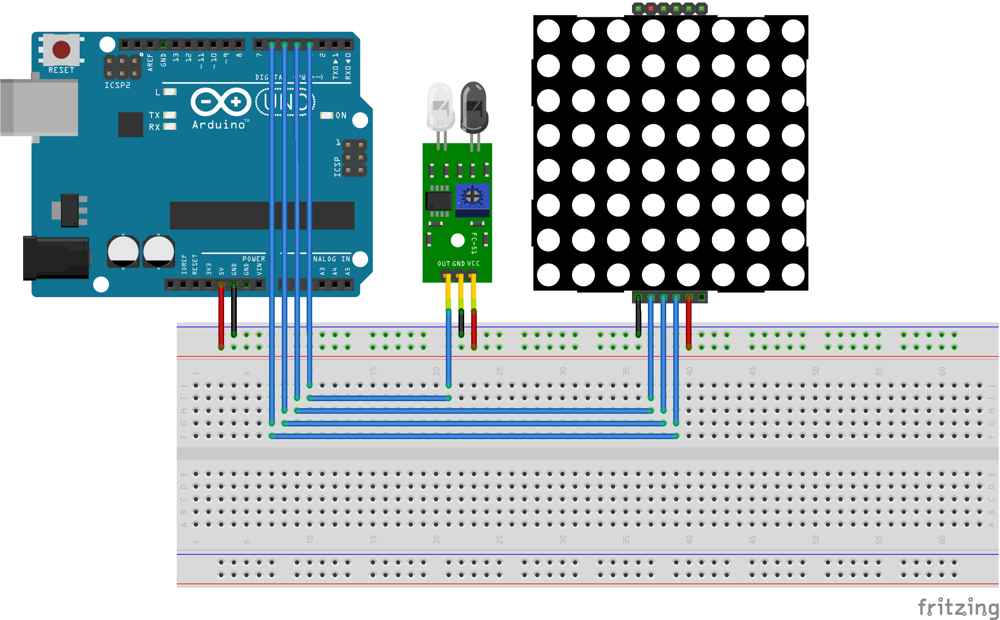
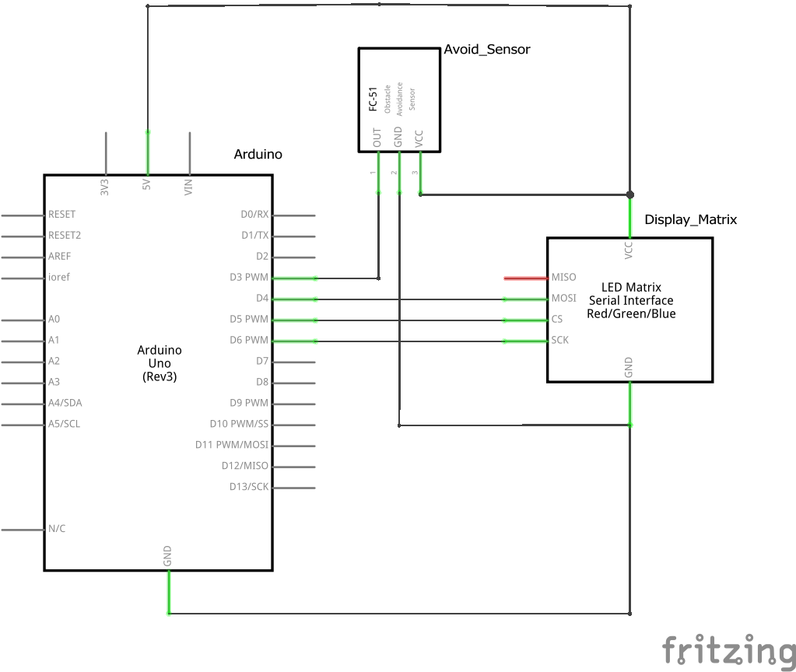

# DesktopBuddy

Another iteration on my [DiscordMatrix](https://github.com/samclane/DiscordMatrix) obsession. Displays a little friend on your desktop, with dynamic facial animations. Changes to relevant symbols when connected to a Discord Voice Server. 

I've ditched PyFirmata, as it was running relatively heavy on my host computer. It would be much more efficient to just write the Arduino code myself and remove unnecessary overhead. The clock marquee, while cool, was on such a small display as to be mostly useless. 

# Circuit

### Hardware 
* [FC-51 Avoidance Sensor](https://www.aliexpress.com/item/Infrared-Barrier-Sensor-obstacle-avoidance/32901220066.html?spm=2114.search0104.3.22.30d853beSNcOVZ&ws_ab_test=searchweb0_0,searchweb201602_1_10065_10130_10068_10890_10547_319_10546_317_10548_10545_10696_453_10084_454_10083_10618_10307_537_536_10902_10059_10884_10887_321_322_10103,searchweb201603_51,ppcSwitch_0&algo_expid=8a110d6b-9138-430e-a413-ad8a69e35af6-3&algo_pvid=8a110d6b-9138-430e-a413-ad8a69e35af6&transAbTest=ae803_4)
* [MAX7219 Dot Matrix LED Module](https://www.aliexpress.com/item/MAX7219-Dot-Matrix-Led-Modul-MCU-Led-anzeige-Steuer-Modul-Kit-ForArduino/32704781738.html?spm=2114.search0104.3.1.594f484fln4yqT&ws_ab_test=searchweb0_0,searchweb201602_1_10065_10130_10068_10890_10547_319_10546_317_10548_10545_10696_453_10084_454_10083_10618_10307_537_536_10902_10059_10884_10887_321_322_10103,searchweb201603_51,ppcSwitch_0&algo_expid=de908990-83ed-42ac-ad36-62b81c48171d-0&algo_pvid=de908990-83ed-42ac-ad36-62b81c48171d&transAbTest=ae803_4)
* [Arduino UNO](https://www.aliexpress.com/item/igh-quality-One-set-UNO-R3-Official-Box-ATMEGA16U2-MEGA328P-Chip-For-Arduino-UNO-R3-Development/32948661593.html?spm=2114.search0104.3.6.61243b7fJhnBjt&ws_ab_test=searchweb0_0,searchweb201602_1_10065_10130_10068_10890_10547_319_10546_317_10548_10545_10696_453_10084_454_10083_10618_10307_537_536_10902_10059_10884_10887_321_322_10103-10890,searchweb201603_51,ppcSwitch_0&algo_expid=c150eb43-a6d0-44eb-a2cf-15bbb767b007-0&algo_pvid=c150eb43-a6d0-44eb-a2cf-15bbb767b007&transAbTest=ae803_4_)

# Running the source code

To install the dependencies, run `pip install -r requirements.txt`. 

The default pinout is:
* DIN = 4
* CLK = 6
* CS = 5
* SENSOR = 3

These values can be changed in `Arduino/MatrixBuddy/main.h`.

To login, copy the contents of `default.ini` into a file called `config.ini` in the same folder. Then, change `Token` to your personal Discord Token ([instructions here](https://github.com/appu1232/Discord-Selfbot/wiki/Installation-&-Setup#grab-your-token-from-discord)). Also change the `mute` value under `[Keybinds]` to the desired key ([key names can be found here](https://pyautogui.readthedocs.io/en/latest/keyboard.html#keyboard-keys)).

### Credits

[Happy Icon by Ilaria Bernareggi from the Noun Project](https://thenounproject.com/search/?q=pixel%20smile&i=508957)

[SysTrayIcon.py by Simon Brunning](http://www.brunningonline.net/simon/blog/archives/SysTrayIcon.py.html)

